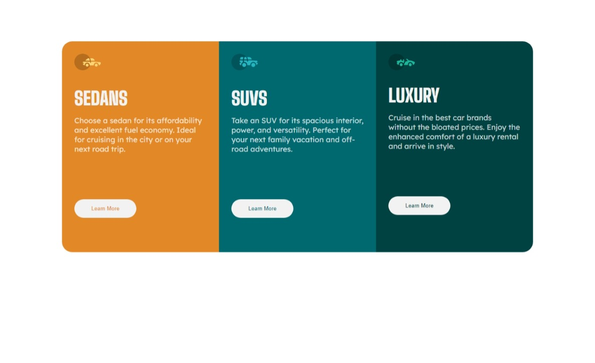
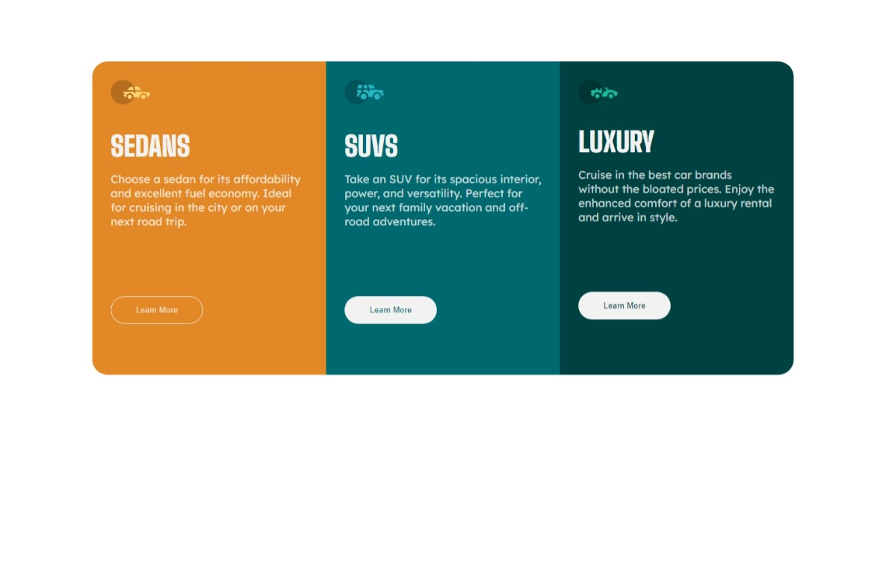

# Frontend Mentor - 3-column preview card component solution

This is a solution to the [3-column preview card component challenge on Frontend Mentor](https://www.frontendmentor.io/challenges/3column-preview-card-component-pH92eAR2-). Frontend Mentor challenges help you improve your coding skills by building realistic projects. 

## Table of contents

- [Frontend Mentor - 3-column preview card component solution](#frontend-mentor---3-column-preview-card-component-solution)
  - [Table of contents](#table-of-contents)
  - [Overview](#overview)
    - [The challenge](#the-challenge)
    - [Screenshot](#screenshot)
    - [Links](#links)
  - [My process](#my-process)
    - [Built with](#built-with)
    - [What I learned](#what-i-learned)
    - [Continued development](#continued-development)
    - [Useful resources](#useful-resources)
  - [Author](#author)

## Overview

### The challenge

Users should be able to:

- View the optimal layout depending on their device's screen size
- See hover states for interactive elements

### Screenshot
Desktop



Mobile


Status Active



### Links

- Solution URL: [GitHub repository](https://github.com/Juan13052001/3-column-preview-card-component-main)
- Live Site URL: [My site](https://juan13052001.github.io/3-column-preview-card-component-main/)

## My process

### Built with

- Semantic HTML5 markup
- CSS custom properties
- CSS Grid

### What I learned

I learned how to use CSS Grid and how to make it fit the screen where it is being displayed.

```css
.container {
    margin: 100px 150px;
    display: grid;
    grid-template-columns: repeat(auto-fit, minmax(250px, 1fr));
}
```

### Continued development

I want to continue developing and using CSS Grid to improve my CSS Grid skills.

### Useful resources

## Author

- Frontend Mentor - [@Juan13052001](https://www.frontendmentor.io/profile/Juan13052001)
